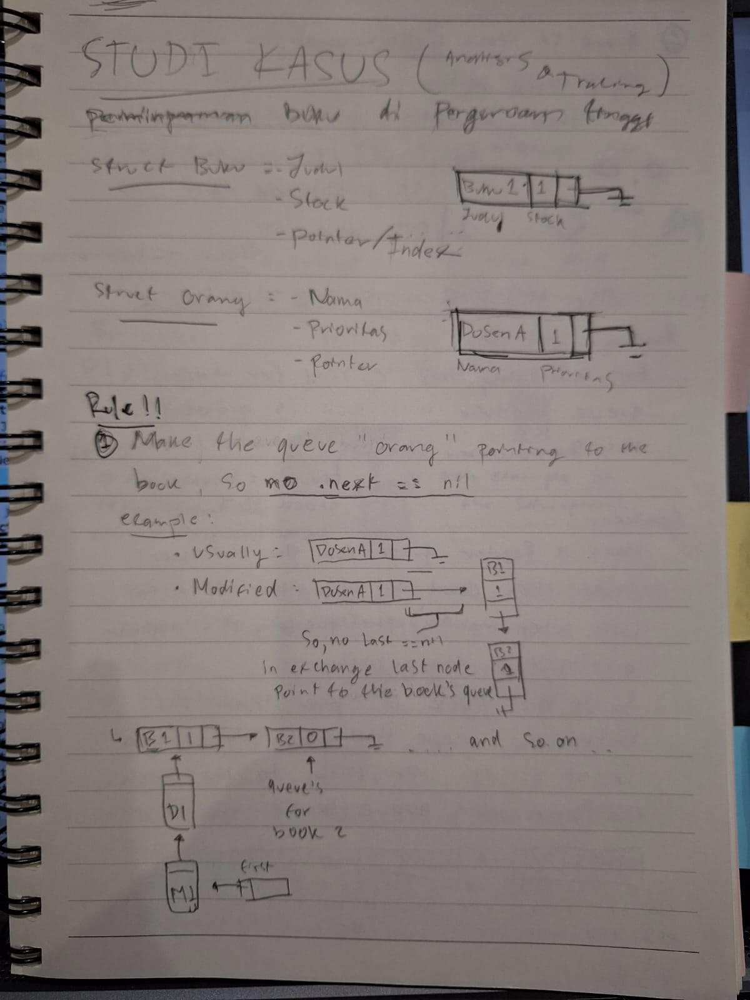
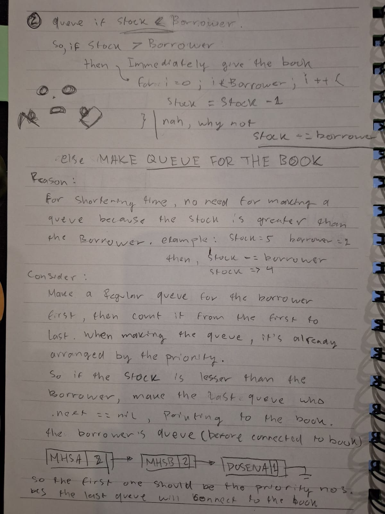
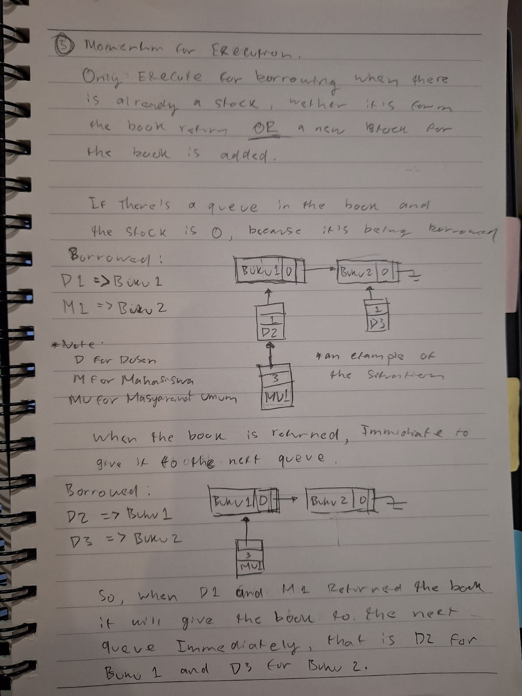
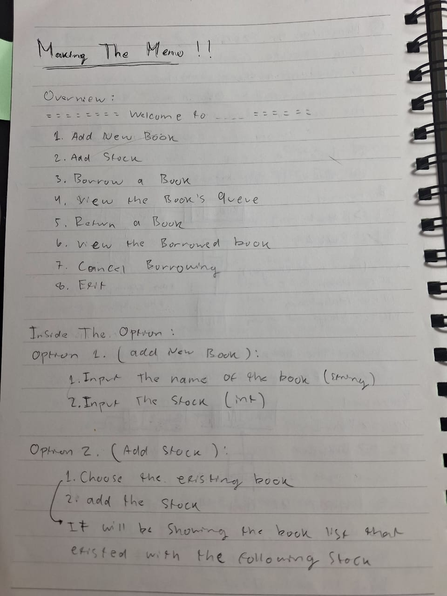
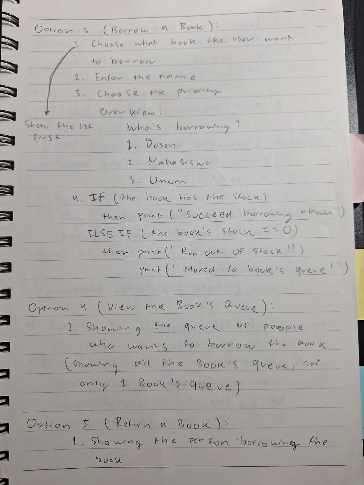
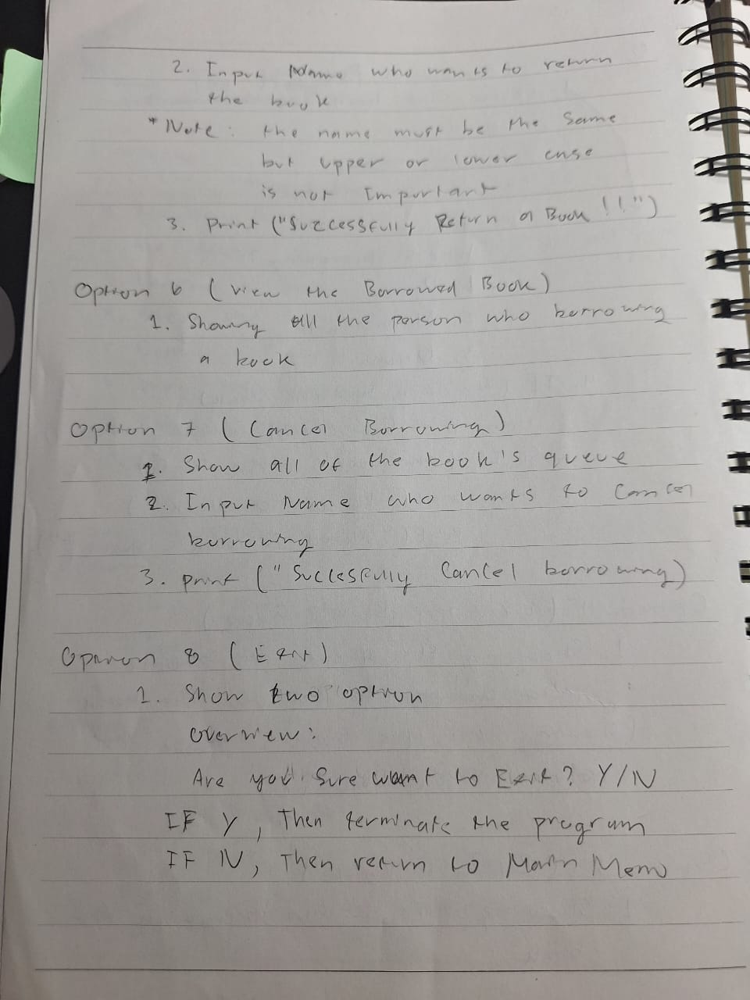
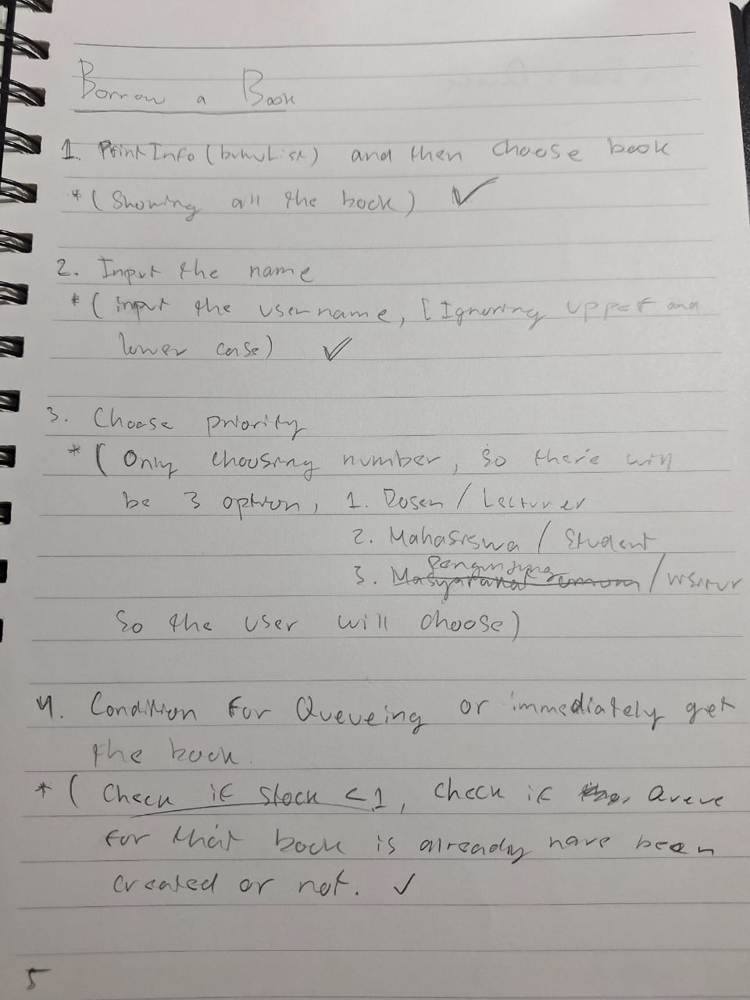
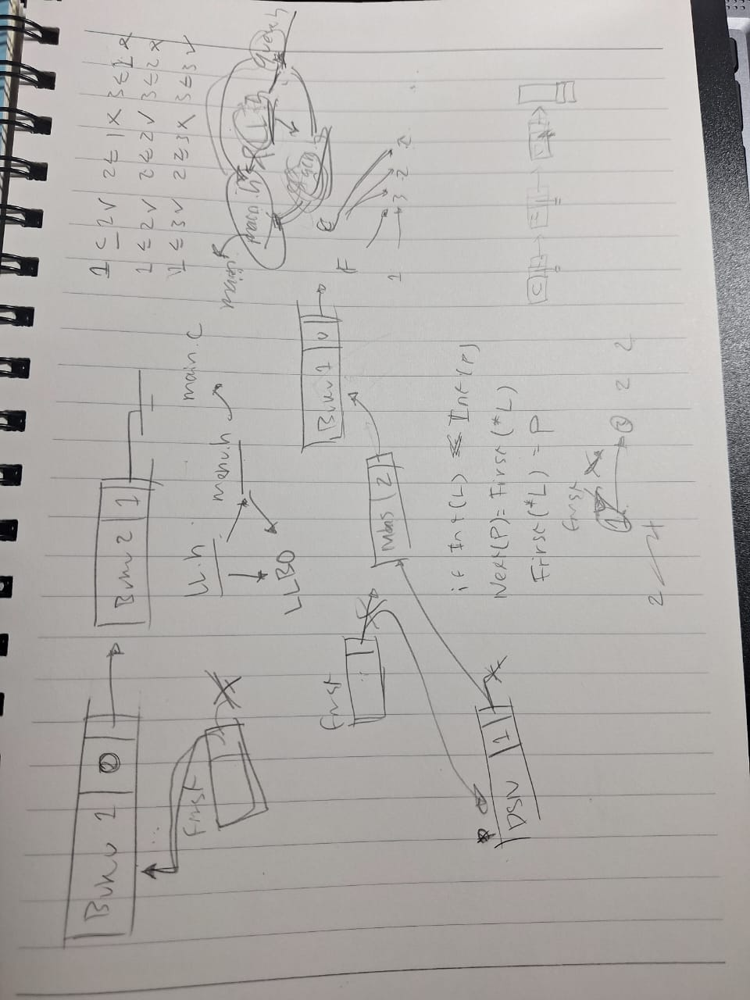

<h1>Linked List Library Case</h1>

Books available in the library, have a stock varying from 1 to N. The types of library members have levels as priority levels, namely students, lecturers, and the general public. When many members order the same book and availability is limited, those with higher priority will get the borrowing facility.

<h4>  ·  <a href="https://github.com/glicthe/Library-Borrowing/blob/master/README.md"> Documentation </a>  ·  <a href="https://github.com/glicthe/Library-Borrowing/issues"> Report Bug </a>  ·  <a href="https://github.com/glicthe/Library-Borrowing/issues"> Request Feature </a> </h4>

## :star2: About the ADT Program
Given 3 scenario of implementation using `Linked List`
 - The **first one** is using a `single Linked List`,
 - **second** using `Double Linked List`
 - The **last** is using an `Array` 

the struct that must be there:
1. Struct `Buku`: 
    - Judul
    - Stock
    - Pointer/index

2. Struct `Orang`;
    - Nama
    - Prioritas
    - Pointer         

## :page_with_curl: Main Menu Option
Breakdown of the menu options and their functionalities in the library system:

### 1. **Add New Book**  
Allows **adding** a `new book` to the library. You provide the `book’s title` and initial `stock` quantity. The system **creates** a record for the book and tracks its availability.

---

### 2. **Add Stock**  
**Increases** the `stock` of an existing book. You specify the `book title` and the number of additional copies to add. If there are pending borrowing requests (`queues`), the system may fulfill them after **updating** the `stock`.

---

### 3. **Borrow a Book**  
Lets a user borrow a book. If the book is in `stock`, it’s assigned immediately. If not, the user is added to a **priority-based queue** (`e.g., lecturers > students > visitors`). The system tracks who is next in line based on priority.

---

### 4. **View the Book’s Queue**  
Displays the waiting list for each book. Shows the `names` and `priorities` (`e.g., lecturer, student`) of users waiting to borrow unavailable books. Helps track who will receive the book next when it’s `returned` or `restocked`.

---

### 5. **Return a Book**  
Processes the return of a `borrowed book`. The `book’s stock` is **incremented**, and the system **automatically** checks its `queue` to assign the returned copy to the next eligible user (`based on priority`).

---

### 6. **View the Borrowed Book**  
**Lists** all `books` currently `borrowed`, including details like the `borrower’s name` and the `book title`. Provides an overview of active loans.

---

### 7. **Cancel Borrowing**  
**Remove**s a user from a `book’s borrowing queue`. Useful if someone no longer wants to wait for the book. **Frees up** their spot in the `queue` for others.

---

### 8. **Undo Last Action**  
**Reverses** the most recent `operation` (`e.g., adding a book, borrowing, returning`). Acts as an "`undo`" feature to correct **accidental** or **erroneous** actions.

---

### 9. **Exit**  
**Closes** the program gracefully.

## :camera: Analysis
 
 
 
 

## :hammer_and_wrench: Reference
> 1. https://github.com/KhuzaimaAwan47/Array-Implementation-of-Linked-List
> 2. https://github.com/ChrisRackauckas/LinkedLists.jl
> 3. Deepseek Ai
> 4. Claude Ai
> 5. [Pak Ade's Code](https://drive.google.com/file/d/1xAQHkF3mZfXNSP3P5tAHSSdu4DeIDEYF/view?usp=sharing).
